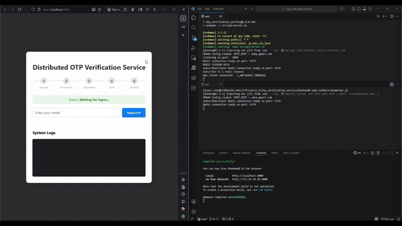
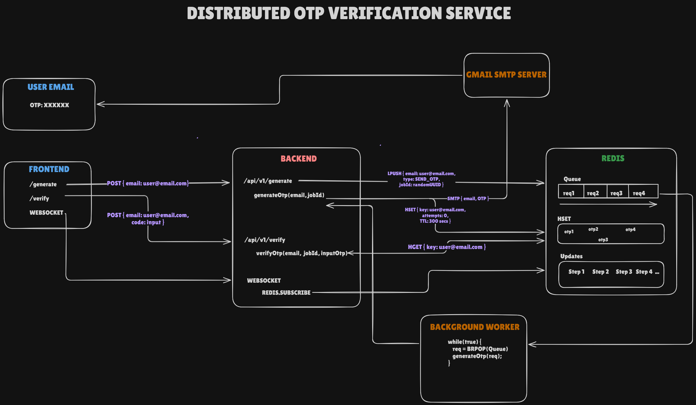

#  Distributed OTP Verification Service

A production-ready, event-driven OTP verification system built with **Node.js**, **Redis**, and **React**. This project demonstrates how to handle high-concurrency requests by decoupling the API from resource-intensive tasks using a message queue.

---

## Demo





---

## Architecture

This system uses a **non-blocking** architecture. The API Gateway accepts requests instantly, while a background worker processes email delivery asynchronously. Real-time updates are pushed to the client via WebSockets.



### Key Components:
1.  **Frontend:** React dashboard for requesting and verifying OTPs.
2.  **API Gateway:** Express server that queues jobs and handles WebSocket connections.
3.  **Redis:** Acts as both a **Task Queue** (for email jobs) and **Pub/Sub** broker (for real-time updates).
4.  **Worker:** Background microservice that processes the queue and sends emails via SMTP.

---

## Features

* **Non-Blocking I/O:** API responds immediately (202 Accepted) without waiting for email delivery.
* **Real-Time Updates:** Users see progress steps (Queued → Processing → Sent) instantly via Socket.io.
* **Security:**
    * **Rate Limiting:** Prevents abuse of the generation endpoint.
    * **DNS Validation:** Ensures email domains actually exist before processing.
    * **Timing-Safe Comparison:** Prevents timing attacks during OTP verification.
* **Dockerized:** Entire stack (Frontend, Backend, Redis) runs with a single command.

---

## Tech Stack

* **Frontend:** React.js, Nginx
* **Backend:** Node.js, Express
* **Database/Cache:** Redis
* **Communication:** REST API, Socket.io, SMTP
* **DevOps:** Docker, Docker Compose

---

## Getting Started

### Prerequisites
* Docker & Docker Compose installed on your machine.
* A Gmail account (for SMTP) with an [App Password](https://support.google.com/accounts/answer/185833).

### Installation

1.  **Clone the repository**
    ```bash
    git clone [https://github.com/your-username/otp-verification-service.git](https://github.com/your-username/otp-verification-service.git)
    cd otp-verification-service
    ```

2.  **Configure Environment Variables**
    Create a `.env` file in the `backend/` and `frontend/`. See the respective .exampleEnv for better understanding

3.  **Run with Docker**
    ```bash
    docker-compose up --build
    ```

4.  **Access the App**
    * **Frontend:** Open [http://localhost:3000](http://localhost:3000)
    * **API Health Check:** [http://localhost:5000/health](http://localhost:5000/health)

---

## Project Structure

```bash
├── frontend/
|   ├── src/
|   └── .env
|
├── backend/
│   ├── src/
│   │   ├── api/          # Express Server & Controllers
│   │   ├── services/     # OTP & Queue Logic
│   │   ├── adapters/     # Redis & Email Clients
│   │   └── utils/        # Validation & Crypto
│   ├── workers/          # Background Worker Scripts
│   └── Dockerfile
├── otp-frontend/
│   ├── src/              # React Components
│   └── Dockerfile
├── .env
├── docker-compose.yml
└── README.md